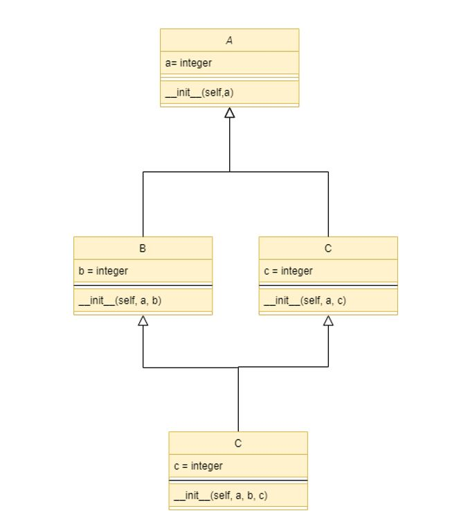

<h1 align="center">Herencias POO</h1>

*Hemos usado la Programación Orientada a Objetos para resolver estos ejercicios.*

---

En este [repositorio](https://github.com/Diegodesantos1/Ejercicios_POO_Grupal) quedan resueltos los ejercicios de herencias en Python. Para llevar a cabo el proyecto nos hemos documentado a través de la teoría que se encuentra en el campus virtual y de otros medios.

***

## Integrantes

1. [@jmedina28](https://github.com/jmedina28)
2. [@mat0ta](https://github.com/mat0ta)
3. [@xavitheforce](https://github.com/Xavitheforce)
4. [@ESTHERRODRIGUEZGARCIA](https://github.com/ESTHERRODRIGUEZGARCIA)
5. [@Diegodesantos1](https://github.com/Diegodesantos1)

***

## Índice
1. [Ejercicio A: Herencia simple ](#id1)
2. [Ejercicio B: Puzzle](#id2)
3. [Ejercicio C: Herencia múltiple - Diamante](#id3)
4. [Ejercicio D: Herencia múltiple - Caso real](#id4)
***

## Ejercicio A: Herencia simple<a name="id1"></a>

Enunciado: Definir una clase Punto2D que tenga dos atributos x e y, y que implemente un método de traslación() que reciba como parámetro las dos componentes horizontal y vertical de la traslación, y modifique las coordenadas del punto en cuestión según el principio de que una traslación (a, b) consiste en sumar a (respectivamente b), al componente x (respectivamente y) de un punto.

Enunciado: Ahora añada la gestión de un punto en tres dimensiones, según los mismos principios que el punto 2D. Nota: esta adición se debe realizar sin acceder directamente a los componentes x e y del punto 3D.


```python
class Punto2D:
    def __init__(self, x, y):
        self.x = x
        self.y = y

    def mostrar(self):
        return "X: "+str(self.x)+"; Y: "+str(self.y)

    def traslacion(self, a, b):
        self.x += a
        self.y += b
        return self.x, self.y

class Punto3D:
    def __init__(self, x, y, z):
        self.x = x
        self.y = y
        self.z = z

    def mostrar(self):
        return "X: "+str(self.x)+"; Y: "+str(self.y)+"; Z: "+str(self.z)

    def traslacion(self, a, b, c):
        self.x += a
        self.y += b
        self.z += c
        return self.x, self.y, self.z

a = Punto2D(1, 2) 
print("A = {}".format(a.mostrar()))
 
a.traslacion(-1, -2) 
print("A = {}".format(a.mostrar()))
 
b = Punto2D(-3, 0) 
b.traslacion(5, -1) 
print("B = {}".format(b.mostrar()))

c = Punto3D(1,5,-3) 
c.traslacion(0, -2, 1) 
print("C = {}".format(c.mostrar()))

```
Su UML es el siguiente:

<br>

<br>

## Ejercicio B: Puzzle<a name="id2"></a>

Enunciado: ¿qué muestra este programa en la salida estándar?

```python
class Base: 
 
    def __init__(self): 
        self.a = "a" 
        self.b = "b" 
        self.c = "c" 
 
    def A(self): 
        print(self.a) 
 
    def B(self): 
        print(self.b) 
 
    def C(self): 
        print(self.c) 
 
class Derivada(Base): 
 
    def __init__(self): 
        self.a = "aa" 
        super().__init__() 
        self.c = "cc" 
 
    def A(self): 
        print(self.a) 
 
    def B(self): 
        self.b = "bb" 
        super().B() 
        print(self.b) 
 
base = Base() 
derivada = Derivada() 
 
base.A() 
derivada.A() 
print() 
base.B() 
derivada.B() 
base.C() 
derivada.C() 
derivada = base 
derivada.C() 
```
Salida estándar:

<br>

<br>


## Ejercicio C: Herencia múltiple - Diamante<a name="id3"></a>

Enunciado: en el caso del temido diamante de la herencia múltiple (ver capítulo Conceptos de la POO, sección Herencia múltiple), donde una clase D hereda de dos clases B y C, ambas heredando de una sola clase A, escriba el código que permita, durante la instanciación, inicializar los atributos a, b y c, pertenecientes respectivamente a las clases A, B y C.

El código empleado es el siguiente:

```python
class A:
    def __init__(self,a):
        self.a = a
class B(A):
    def __init__(self, a, b):
        self.b = b
        super(A)
class C(A):
    def __init__(self, a, c):
        self.c = c
        A.__init__(self, a)
class D(B,C):
    def __init__(self, a, b, c):
        B.__init__(self, a, b)
        C.__init__(self, a, c)

d = D(1, 2, 3)

print(isinstance(d, A), isinstance(d, B), isinstance(d, C))

print(d.a, d.b, d.c)
```

Su UML es el siguiente: 


<br>

<br>

## Ejercicio D: Herencia múltiple - Caso real<a name="id4"></a>

Enunciado: Implementar un programa que calcule la superficie total acristalada de una casa, sabiendo que una casa está formada por paredes y que cada pared tiene una orientación (Norte, Oeste, Sur, Este) y posiblemente ventanas. Una ventana tiene una superficie que se da como parámetro durante su construcción.

Enunciado: los edificios modernos tienen a menudo fachadas llamadas "paredes cortina" que actúan como paredes exteriores al mismo tiempo que son una superficie acristalada transparente. Su código debe poder gestionar este nuevo concepto, sabiendo que una pared cortina se define por su orientación y su superficie.

Enunciado: se publica una nueva regulación térmica del edificio e impone protecciones externas en las ventanas, con el fin de aumentar el aislamiento de las casas residenciales. Su código ahora debe detenerse si alguna vez se crea una instancia de una ventana sin protección externa (para eso, use el comando raise Exception("mensaje"); este mecanismo se explicará en la sección dedicada a las excepciones). En el contexto de este ejercicio, la protección se limitará a una cadena de caracteres ("Persiana", "Estor", etc.).

El código empleado es el siguiente:

```python
class Casa():
    def __init__(self):
      self.casa = {}
    def Paredes(self, orientacion):
      for i in range(len(orientacion)):
        nombre = orientacion[i]
        self.casa[nombre] = {
            'ventanas': {},
        }
      print(self.casa)
      Casa().Ventanas(self.casa, [['NORTE', 0.5], ['SUR', 1], ['ESTE', 2], ['OESTE', 1]])
    def Ventanas(self, casa, ventanas):
      dimensiones = []
      for i in range(len(ventanas)):
        nombre = ventanas[i][0]
        casa[nombre]['ventanas'] = {
          1: ventanas[i][1]
        }
        dimensiones.append(ventanas[i][1])  
      print(casa)
      Casa().Superficie(dimensiones)
      
    def Superficie(self, dimensiones):
      total = 0
      for i in range(len(dimensiones)):
        total += dimensiones[i]
      print('Superficie avristalada: ' + str(total))
   
```

Su UML es el siguiente: 


<br>

<br>

