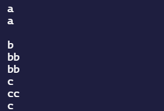

<h1 align="center">Herencias POO</h1>

*Hemos usado la Programación Orientada a Objetos para resolver estos ejercicios.*

---

En este [repositorio](https://github.com/Diegodesantos1/Ejercicios_POO_Grupal) quedan resueltos los ejercicios de herencias en Python. Para llevar a cabo el proyecto nos hemos documentado a través de la teoría que se encuentra en el campus virtual y de otros medios.

***

<h3>Integrantes</h3>

1. [Juan](https://github.com/jmedina28)
2. [Martín](https://github.com/mat0ta)
3. [Javier](https://github.com/Xavitheforce)
4. [Esther](https://github.com/ESTHERRODRIGUEZGARCIA)
5. [Diego](https://github.com/Diegodesantos1)

***

## Índice
1. [Ejercicio A: Herencia simple ](#id1)
2. [Ejercicio B: Puzzle](#id2)
3. [Ejercicio C: Herencia múltiple - Diamante](#id3)
4. [Ejercicio D: Herencia múltiple - Caso real](#id4)
***

## Ejercicio B: Puzzle<a name="id2"></a>

Enunciado: ¿qué muestra este programa en la salida estándar?

```python
class Base: 
 
    def __init__(self): 
        self.a = "a" 
        self.b = "b" 
        self.c = "c" 
 
    def A(self): 
        print(self.a) 
 
    def B(self): 
        print(self.b) 
 
    def C(self): 
        print(self.c) 
 
class Derivada(Base): 
 
    def __init__(self): 
        self.a = "aa" 
        super().__init__() 
        self.c = "cc" 
 
    def A(self): 
        print(self.a) 
 
    def B(self): 
        self.b = "bb" 
        super().B() 
        print(self.b) 
 
base = Base() 
derivada = Derivada() 
 
base.A() 
derivada.A() 
print() 
base.B() 
derivada.B() 
base.C() 
derivada.C() 
derivada = base 
derivada.C() 
```
Salida estándar:

<br>

<br>
